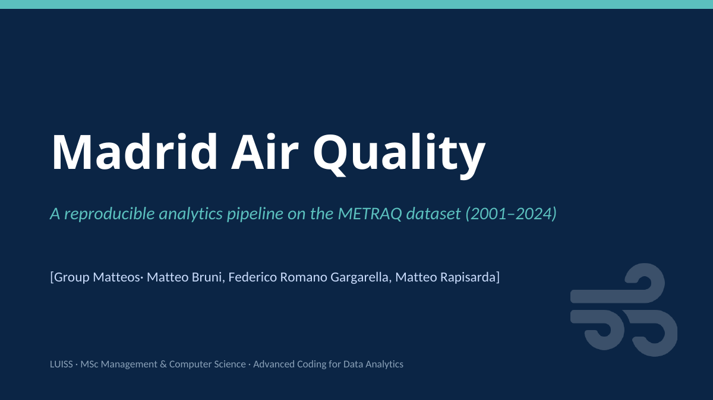
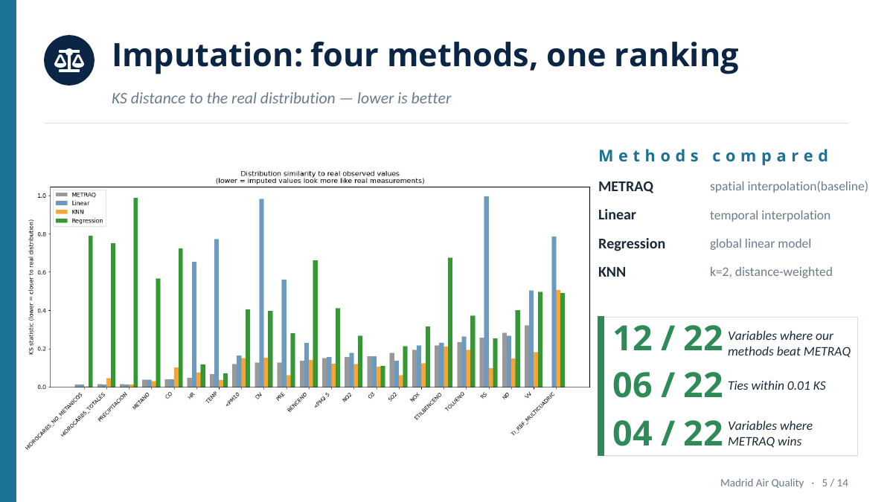
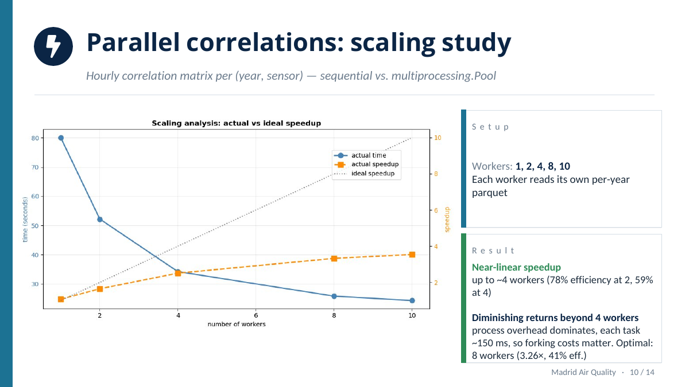
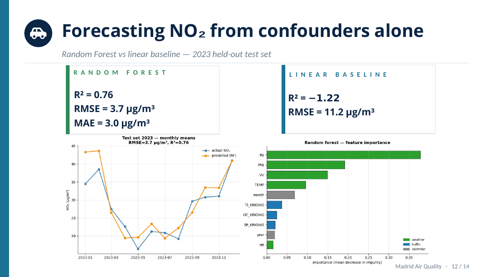
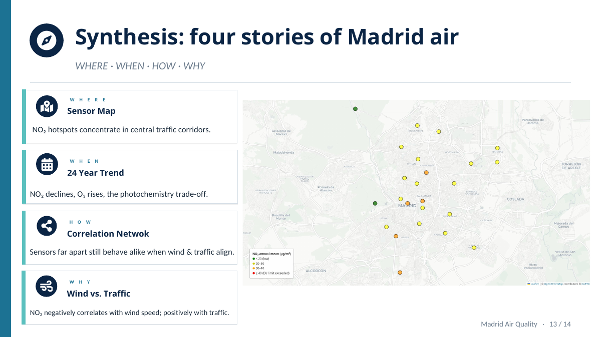

# Madrid Air Quality Analytics Pipeline

A reproducible Python pipeline for exploring Madrid air quality patterns using the METRAQ dataset, with a focus on cleaning, imputation, sensor networks, parallel computation and NO2 forecasting.



## Why this project

Air quality is not just an environmental topic. It is a public-health and urban-management problem where messy data, sensor coverage and local conditions matter a lot.

This project uses hourly observations from Madrid between 2001 and 2024 to answer four practical questions:

- **Where** are pollution patterns concentrated?
- **When** do pollution levels peak across hours, seasons and years?
- **How** do sensors relate to each other spatially and behaviorally?
- **Why** do pollutants move with traffic and weather conditions?

## What we built

The repository contains a single reproducible notebook plus a helper script for multiprocessing. The pipeline covers:

- data inspection and quality checks;
- treatment of physically impossible readings;
- comparison of four imputation strategies;
- construction of a best-of-breed imputed dataset;
- temporal trend analysis across pollutants;
- spatial and correlation-based sensor networks;
- multiprocessing benchmarks for correlation analysis;
- Random Forest forecasting of monthly NO2 from weather, traffic and calendar variables.

## Highlights

### Imputation comparison

We compared METRAQ interpolation, linear interpolation, KNN and regression-based imputation using KS distance against the observed distribution. The final approach selected the best method variable by variable rather than forcing a single method across the whole dataset.



### Parallel correlation analysis

The pipeline benchmarks sequential execution against `multiprocessing.Pool`. The result is useful but realistic: speed improves clearly at first, then slows down once process overhead starts dominating.



### NO2 forecasting

Using weather, traffic and calendar variables only, the Random Forest model outperformed the linear baseline on the held-out 2023 test set.



### Final synthesis

The analysis ties the project together around four stories: where pollution concentrates, when it changes, how sensors behave together, and why NO2 is connected to traffic and weather.



## Repository structure

```text
.
├── README.md
├── main.ipynb
├── worker.py
├── requirements.txt
├── assets/
│   ├── cover.png
│   ├── imputation-ranking.png
│   ├── parallel-scaling.png
│   ├── no2-forecasting.png
│   └── synthesis-map.png
├── presentation/
│   └── madrid-air-quality-presentation.pdf
├── docs/
│   └── project-summary.md
└── data/
    └── README.md
```

## How to run it

Create a virtual environment and install the dependencies:

```bash
python -m venv venv
source venv/bin/activate      # Windows: venv\Scripts\activate
pip install -r requirements.txt
```

Download the METRAQ dataset from Hugging Face:

```text
https://huggingface.co/datasets/dmariaa70/METRAQ-Air-Quality
```

Place the CSV in the repository root and rename it to:

```text
metraq_air_quality.csv
```

Then open and run:

```text
main.ipynb
```

`worker.py` must stay in the same folder as `main.ipynb`, because the multiprocessing section imports it.

## Generated files

The notebook can create local folders such as:

```text
imputation_results/
data_by_year/
correlation_matrices/
outputs/
figures/
```

These are intentionally ignored in Git because they are generated outputs, not source files.

## Authors

Matteo Bruni, Federico Romano Gargarella, Matteo Rapisarda.

## Context

Academic analytics project developed at LUISS Guido Carli University for Advanced Coding for Data Analytics.

This is the standalone portfolio version of the project, prepared outside the original fork so that the repository is easier to read, run and share.
